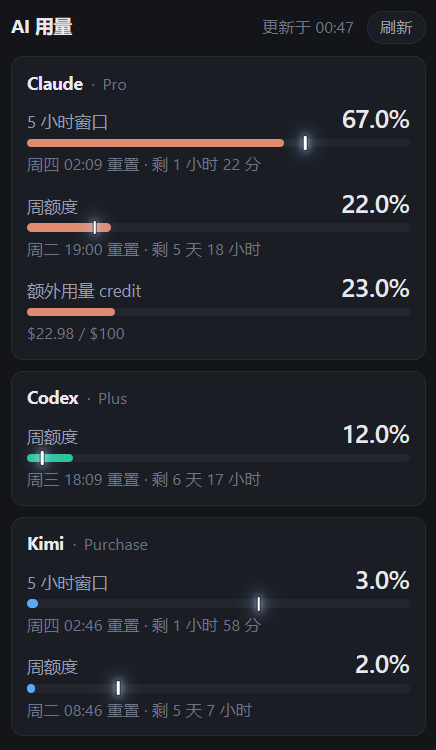

# ai-usage

[](https://github.com/yxhuang/ai-usage/releases/latest)
[](https://github.com/yxhuang/ai-usage/actions/workflows/ci.yml)
[](../LICENSE)
[](https://www.python.org/)


把 Claude、Codex、Kimi 三家的订阅额度显示在同一个小窗口里。

[English](../README.md) | 简体中文 · [更新日志](CHANGELOG.zh-CN.md)

三家的额度分别在各自的后台，平时都不提示，等你注意到的时候一般已经被限流了。
这个工具把三家的数字读出来，放在一个常开的小面板上。

<p align="center">
  
</p>

图里 Claude 那两根条可以对比着看。5 小时那根没到竖线，周额度那根越过了竖线：
同一个账号同一时刻，一个还有余量，一个已经花超前了。而它们的百分比是 67% 和 22%，
只看数字会得出相反的结论。

## 节奏刻度

进度条上那道竖线标的是时间窗口已经过去了多少，用量条要对着它读。

```
周额度   ███████████████████░░░░░░░░░░░┃░░░░░░░░░   用了 48%，这周过去了 78%
                                                    在竖线左边，还有余量

5 小时   █████████████┃██████████░░░░░░░░░░░░░░░░   用了 61%，窗口才过去 34%
                                                    越过竖线，花得偏快
```

在竖线左边，说明花得比额度回补慢，可以接着用。越过竖线，说明照这个速度会在重置前用完，
越过得越多、撞上限越早。百分比告诉你花了多少，竖线补上的是还能不能这么花。

它画成一根两端探出条外的发光指针，带一圈描边，压在填充色上也不会糊。整个面板就这一处比较
扎眼，是故意的：要眯眼才看得清的刻度不会有人真去用。它用墨色而不是红色，因为红色在这里
已经表示用量 ≥90% 了。

进度条正常时用各家的品牌色区分（Claude 珊瑚橙、Codex 青绿、Kimi 蓝），到 70% 和 90% 统一
换成警戒色。那两档是状态信号，不该被品牌色盖住。

## 它不做什么

凭证只发回给对应的厂商，不经过任何第三方。三家的鉴权方式不同：Claude 读 claude CLI 写下的
OAuth 文件，Codex 由它自己的 app-server 使用登录态，Kimi 用你配置的 API key。凭证只在内存
里，落盘的只有用量数字。服务在配置校验阶段就拒绝绑定回环地址以外的地址。

跑它不花钱。这些是账户接口，不是推理接口，轮询不消耗对话额度。

## 快速上手

```bash
git clone https://github.com/yxhuang/ai-usage && cd ai-usage
uv sync
uv run python -m server.launch     # 打开 http://127.0.0.1:8788
```

不用建配置文件也能跑。没登录的那家显示一张错误卡片，不影响其余两家。

配置文件放在别处的话用 `--config`：

```bash
uv run python -m server.launch --config ~/.config/ai-usage/config.toml
```

想让它在后台常驻（Linux，systemd user unit）：

```bash
bash deploy/install.sh
journalctl --user -u ai-usage -f     # 看日志
```

## 环境要求

- Python 3.11+ 和 [uv](https://docs.astral.sh/uv/)
- 至少配好一家。三家的前置条件不一样：

| Provider | 前置条件 |
|---|---|
| Claude | 装好并登录 `claude` CLI，面板只读复用它的 OAuth token。 |
| Codex | 装好并登录 `codex` CLI，且 `codex` 在 `PATH` 里。面板临时拉起 `codex app-server` 取数，失败时降级读本地 session 记录。 |
| Kimi | 一个 `sk-kimi-*` API key。Kimi 不读 CLI 登录态，只认 API key：在 `config.toml` 写 `providers.kimi.api_key`、export `KIMI_API_KEY`、或用 `providers.kimi.api_key_file` 指向一个含 key 的文件，三者任一。 |

面板自己没有登录流程，也不会问你要密码。

运行时依赖只有 `fastapi`、`uvicorn`、`httpx`。前端是纯 HTML/CSS/JS，没有构建步骤，
不需要 node。

## 各系统上怎么用

服务端是纯 Python，没有平台相关代码。差别只在怎么把面板显示成一个窗口。

| | 状态 |
|---|---|
| Linux | 主要开发环境，在 WSL2 Ubuntu 上日常使用。 |
| macOS | 代码路径完全相同，应该能跑，但还没在真机上验证过，欢迎反馈。 |
| Windows | daemon 跑在 WSL 里，面板从 Windows 侧打开。WSL2 会自动转发 `localhost`，不用额外配网络。 |

开窗口最省事的办法是用浏览器的 app 模式，没有地址栏也没有标签栏，看着接近原生挂件：

```
chrome --app=http://localhost:8788 --window-size=370,640
```

把这条做成快捷方式就能双击打开。Windows 建 `.lnk`，macOS 用 Automator 应用或 `.command`
文件，Linux 写个 `.desktop`。Windows 侧的详细做法（包括窗口尺寸为什么改了不生效）见
[deploy/windows-shortcut.md](../deploy/windows-shortcut.md)。

Windows 上还可以用 [`deploy/tray-widget.ps1`](../deploy/tray-widget.ps1) 把它收进系统托盘。
窗口不占任务栏和 Alt+Tab，标题栏的关闭和最小化都改成收进托盘，单击托盘图标切换显隐，
再打开时回到上次的位置和尺寸。它只用系统自带的 PowerShell、WinForms 和 `user32.dll`，
不需要 Electron 之类的运行时，加载的也还是同一个 `localhost:8788` 页面。
[`deploy/install-widget.ps1`](../deploy/install-widget.ps1) 可以把已有的快捷方式改成启动它。

代价要说清楚：它是从外部操纵 Chrome 的窗口，属于 hack。脚本必须常驻，Chrome 大版本升级
改了窗口结构就可能失灵。标题栏砍不掉（Chrome 自绘），不过留着反而有拖拽区，窗口能挪。

## 跟随编辑器启动

这个项目没有开机自启，是故意的。开机的时候你未必要干活，打开编辑器基本就等于要干活了，
所以触发点选在编辑器上：打开 VSCode 的时候把面板带出来，关掉编辑器就不管。

[`deploy/vscode-hook.sh`](../deploy/vscode-hook.sh) 做三件事：读开关、确认 daemon 在跑
（没跑就拉起来）、打开面板窗口。重复调用不会开出第二个窗口。

开关在面板里：底部「设置」展开，第一项就是「跟随编辑器启动」。钩子没装的时候它会直说
「未检测到编辑器钩子」，不会给你一个点了没用的开关。

命令行也能改，跟界面读写的是同一个状态：

```bash
deploy/vscode-hook.sh --status     # 看当前状态
deploy/vscode-hook.sh --disable    # 关掉，之后 hook 被调用也直接退出
deploy/vscode-hook.sh --enable     # 开回来
```

开关就是一个标志文件 `~/.config/ai-usage/vscode-hook.disabled`，手动删掉等同于开启。
除了这个文件，脚本不往你系统里写任何东西。

**WSL + VSCode Remote**：Remote-WSL 在启动 server 之前会 source
`~/.vscode-server/server-env-setup`，在那个文件里加一段就行：

```sh
if [ -x ~/ai-usage/deploy/vscode-hook.sh ]; then
    setsid ~/ai-usage/deploy/vscode-hook.sh </dev/null >/dev/null 2>&1 &
fi
```

`setsid` 不能省。那个文件是被 source 的，不脱离进程组的话会拖住 VSCode 启动，
而且关掉 VSCode 时面板会被一起收走。

**其他环境**：VSCode 没有官方的本地启动钩子，可以装一个能在启动时跑命令的扩展来调这个
脚本；也可以不挂钩子，用上一节的快捷方式手动开。后者是完全正常的用法，只是少了「打开
编辑器它自己出现」这一步。

如果你要的就是开机自启，用系统自带的机制即可：Windows 把快捷方式丢进 `shell:startup`，
macOS 加进「登录项」，Linux 用 `deploy/install.sh` 装的 systemd unit。这个项目不打算再包
一层自己的自启动管理，[原因记在这份存档设计里](specs/2026-08-02-autostart-design.md)。

## 三家的数据从哪来

| Provider | 取数方式 | 说明 |
|---|---|---|
| Claude | `GET api.anthropic.com/api/oauth/usage` | 复用 claude CLI 的 OAuth token。返回 5 小时和周窗口，以及单独计费的 extra credit 池。 |
| Codex | 临时拉起 `codex app-server`，JSON-RPC 调 `account/rateLimits/read` | 取完即关，不常驻。失败时降级解析本地 session 记录里最近一条限额快照，标成 `stale` 并附上数据时刻。 |
| Kimi | `GET api.kimi.com/coding/v1/usages` | 用 `sk-kimi-*` API key。报文只给绝对值，百分比在本地换算。 |

三家完全独立，一家挂了只有那张卡片显示错误态，其余照常刷新。轮询默认 300 秒一次，
单家失败后指数退避：首次等 60 秒，之后逐次翻倍，上限 30 分钟。

这些都不是官方公开接口。三个端点没有一个有文档，任何一家都可能随时改动或下线。
详见文末免责声明。

## 配置

所有配置项都是可选的，模板见 [config.example.toml](../config.example.toml)。
不建 `config.toml` 就用内置默认值。几个值得知道的：

- `server.port` 默认 `8788`。`server.host` 只接受回环地址，填别的会直接拒绝启动。
- `providers.<id>.proxy` 三家都支持。不写、写空串、写纯空白都表示直连，
  而且此时会主动忽略 `HTTP_PROXY` 这类环境变量，配置值是唯一让流量走代理的途径。
  反过来有个例外：代理软件开着 TUN 模式时会抢走默认路由、在 IP 层接管流量，
  那不是任何配置能豁免的。如果某家突然持续超时、而用 `curl` 走代理端口却正常，
  先看 `ip route get <目标 IP>`，别先怀疑上游 API。
- `poller.first_retry_seconds` 是首次轮询失败后等多久重试，默认 60 秒。之后每次连续失败
  翻倍，上限是 `max_backoff_seconds`。成功的轮询一律用 `interval_seconds`。
- `providers.kimi` 的 key 按 `api_key`、环境变量、密钥文件三级回退，第一个取到的生效。
  不配 `api_key_file` 就跳过文件这一路。密钥文件是用正则提取变量值，不会 source 或执行它。
- `providers.codex.command` 是拉起 app-server 的命令，默认 `codex`，包装过就改这里。

## 安全

- 服务只绑回环地址，配置层面强制校验，没有「不小心暴露到局域网」的可能。
- 凭证只发回其所属厂商，不发往任何第三方。Claude 只读复用 CLI 写下的 OAuth 文件，
  Codex 由 app-server 使用它自己的登录态，Kimi 使用配置的 API key。凭证只在内存里，
  不落盘，不进日志。落盘缓存 `data/cache.json` 里只有用量数字。
- 日志遇到异常只记 provider 名和异常类型，不记异常正文和 traceback，
  因为正文里可能夹带含 token 的 URL。
- 不读取、不展示、不存储任何账号身份信息，没有邮箱、组织 ID、用户 ID。
- `config.toml` 和 `data/` 已在 `.gitignore` 里。如果把 key 直接写进 `config.toml`，
  记得 `chmod 600`。

## 开发

```bash
uv run pytest          # 117 项测试，不联网，不读真实凭证
```

测试用 `httpx.MockTransport` 和临时目录构造报文与假凭证。`tests/conftest.py` 会把凭证类
环境变量从测试进程里剥掉。这条防护来自一次真实事故：某条用例没清理环境变量，
把开发机上的真实 key 打进了断言失败输出。

## 现状

还很早期。逻辑有 117 项离线测试覆盖，但目前只在一台机器上跑过。如果某家的报文结构在你的
账号上不一样（不同套餐档位、不同区域），带上脱敏后的报文提个 issue 会很有帮助。

界面目前只有中文。文案分散在前端和 provider 两层，做英文要两边都动，不难，只是还没人
需要。用得上就开个 issue。

v1 之前不做：历史曲线、阈值告警、Tauri / Electron 壳、OAuth token 自动续期、
多用户与远程访问。

各版本改了什么见[更新日志](CHANGELOG.zh-CN.md)。版本号遵循
[语义化版本](https://semver.org/lang/zh-CN/)，1.0.0 之前次版本号变动也可能改变行为。

## 参与

欢迎 issue 和 PR，尤其欢迎来自另一台机器的反馈，或者一个 macOS 的可用性确认。
改代码的话注意别把 `/home/<用户名>` 这类绝对路径提交进去。

## 免责声明

ai-usage 是个人的非官方工具，与 Anthropic、OpenAI、Moonshot AI 均无隶属、背书或支持关系。
文中出现的产品名仅用于指代它所读取的服务。

它依赖的是三家未公开文档的账户元数据接口，厂商随时可能改动或下线；它也会读取这些 CLI
管理的凭证文件，只读，且只把凭证发回它本来所属的那家厂商。即便如此，使用风险由你自己
承担，是否符合服务条款也需要你自己把关。软件按现状提供，不附带任何担保，
见 [LICENSE](../LICENSE)。

## 致谢

由它所监控额度的那几位助手一起做出来的：Claude Code、Codex CLI、Kimi CLI。
设计文档：[docs/specs/2026-07-26-ai-usage-design.md](specs/2026-07-26-ai-usage-design.md)。

## 许可

[MIT License](../LICENSE)。

---

⭐ 如果它让你少撞了一次限流，点个 star 能帮别人找到它。
